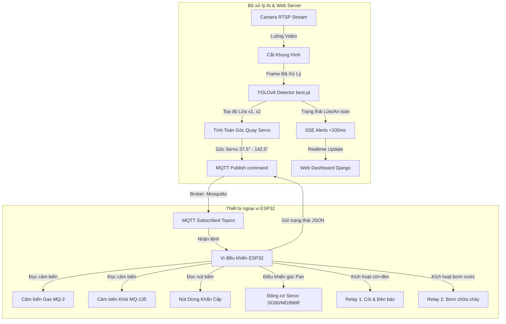

# HỆ THỐNG PHÒNG CHÁY CHỮA CHÁY THÔNG MINH TÍCH HỢP AI (YOLOv8) & IOT (ESP32)
> **Đồ án môn học: Dự án PBL4 (Project Based Learning 4)**
> **Trường Đại học Bách Khoa - Đại học Đà Nẵng (DUT)**

---

## 📝 Giới thiệu chung

Dự án **Hệ thống Phòng cháy Chữa cháy (PCCC) thông minh** là một giải pháp tích hợp toàn diện giữa công nghệ nhận dạng hình ảnh bằng Trí tuệ nhân tạo (**AI - YOLOv8**) và điều khiển nhúng thời gian thực (**IoT - ESP32**) qua giao thức mạng **MQTT**. 

Hệ thống hoạt động như một chu trình khép kín tự động: giám sát môi trường bằng các cảm biến vật lý (Gas, Khói), phân tích luồng video camera trực tiếp bằng AI để phát hiện đám cháy, tự động điều khiển hướng vòi phun nước (Động cơ Servo) nhắm chính xác vào tâm ngọn lửa để dập tắt và kích hoạt hệ thống cảnh báo (Còi, Đèn). Tất cả dữ liệu và quyền điều khiển được trực quan hóa trên một giao diện Web Dashboard hiện đại với độ trễ cực thấp.



---

## ✨ Các tính năng nổi bật

### 1. Nhận diện đám cháy bằng Trí tuệ nhân tạo (AI YOLOv8)
* Huấn luyện mô hình YOLOv8 trên tập dữ liệu đám cháy và khói chất lượng cao (`best.pt`).
* Tự động điều chỉnh luồng camera, tối ưu hóa khung hình bằng thuật toán **Crop vùng ảnh thật** (loại bỏ dải đen padding của luồng RTSP camera).
* Cơ chế xác nhận trạng thái cực nhanh để chống báo động giả: **Xác nhận Lửa sau 3 khung hình liên tục (~150ms)** và **Xác nhận An toàn ngay sau 1 khung hình trống (~50ms)**.

### 2. Định vị ngọn lửa & Hướng vòi phun chủ động
* Dựa trên tọa độ hộp giới hạn (Bounding Box) của đám cháy do YOLOv8 cung cấp, hệ thống tự động ánh xạ góc nhìn Camera FOV **105°** sang góc quay vật lý của động cơ Servo **(37.5° - 142.5°)**.
* Đảo ngược hướng quay thông minh (vì góc nhìn camera và góc servo vật lý đối xứng gương) để hướng vòi phun nước phun trực diện vào ngọn lửa.
* Khi hệ thống chuyển sang trạng thái an toàn, vòi phun tự động reset về vị trí mặc định chính giữa **(90°)**.

### 3. Tự động hóa & Ưu tiên an toàn phần cứng
* Tích hợp cảm biến **Gas (MQ-2)** và **Khói (MQ-135)** trên mạch ESP32. Khi các chỉ số vượt ngưỡng an toàn (>1500), còi báo động vật lý tự động kích hoạt độc lập mà không cần kết nối Server.
* **Nút bấm dừng khẩn cấp (Emergency Stop)** vật lý ngắt ngay lập tức toàn bộ hệ thống còi đèn và bơm khi được kích hoạt nhằm kiểm soát thiết bị thủ công khi có sự cố kỹ thuật.
* Máy trạng thái tự động dập lửa trên Django: khi AI báo hết lửa, hệ thống duy trì bơm thêm **5 giây (`SAFE_TIMEOUT = 5`)** để đảm bảo lửa được dập tắt hoàn toàn, sau đó mới tắt thiết bị và reset Servo.

### 4. Hệ thống Web Dashboard Real-time (Django)
* Thiết kế tối ưu độ trễ với công nghệ **SSE (Server-Sent Events)** dùng cơ chế Queue và Threading Event để đẩy thông báo khẩn cấp từ AI đến giao diện người dùng dưới **100ms** (không dùng polling liên tục gây quá tải).
* Xem trực tiếp luồng camera giám sát đã vẽ khung nhận diện (Bounding Box) và phần trăm tin cậy của AI.
* Đồ thị giám sát thông số cảm biến Gas, Khói theo thời gian thực trực quan.
* Chế độ điều khiển linh hoạt: **Tự động (Auto Mode)** theo AI và Cảm biến, hoặc **Thủ công (Manual Mode)** cho phép Admin tự bật/tắt bơm, còi đèn, quay Servo góc bất kỳ từ Dashboard.
* **Phân quyền tài khoản chặt chẽ**:
  * **Admin**: Xem luồng camera, toàn quyền điều khiển thiết bị, quản lý danh sách tài khoản người dùng, xuất lịch sử sự kiện ra file CSV.
  * **User**: Giám sát trạng thái hệ thống, xem thông số cảm biến và cảnh báo.

---

## 🛠 Sơ đồ kết nối phần cứng (ESP32)

Dưới đây là sơ đồ ánh xạ các chân GPIO trên bo mạch **ESP32 NodeMCU**:

| Thiết bị ngoại vi | Chân kết nối ESP32 | Loại tín hiệu | Ghi chú |
| :--- | :---: | :---: | :--- |
| **Cảm biến Gas MQ-2** | **GPIO 32** | Analog Input | Đo nồng độ khí gas rò rỉ |
| **Cảm biến Khói MQ-135** | **GPIO 33** | Analog Input | Đo nồng độ khói/bụi mịn |
| **Relay 1 (Còi + Đèn)** | **GPIO 23** | Digital Output | Mức cao (HIGH) = Bật chuông & Đèn chớp |
| **Relay 2 (Máy bơm nước)**| **GPIO 22** | Digital Output | Mức cao (HIGH) = Kích hoạt bơm nước dập lửa |
| **Nút dừng khẩn cấp** | **GPIO 13** | Digital Input | Sử dụng trở kéo xuống (PULLDOWN). Nhấn = HIGH |
| **Động cơ Servo (Pan)** | **GPIO 21** | PWM Output | Điều khiển hướng quay vòi phun |

---

## 📡 Cấu trúc luồng dữ liệu MQTT (Broker)

Giao thức **MQTT** được chuẩn hóa giúp kết nối đa kênh giữa Vi điều khiển ESP32, Bộ xử lý AI Django và Node-RED:

### 1. Vi điều khiển ESP32 gửi lên (Publish)
* **`pccc/esp32/sensors`**: Gửi gói tin định dạng JSON định kỳ mỗi 1 giây:
  ```json
  {
    "gas": 1420,
    "smoke": 350,
    "relay2": 0,
    "timestamp": 128475
  }
  ```
* **`pccc/esp32/status`**: Gửi gói tin heartbeat kiểm tra kết nối thiết bị ("online"/"offline").

### 2. Django Server gửi xuống ESP32 (Subscribe)
* **`pccc/esp32/relay`**: Nhận lệnh điều khiển Bơm (Relay 2) hoặc Còi Đèn (Relay 1):
  * Bật hệ thống: `{"relay2": 1, "source": "ai_fire", "servo_target_angle": 105}`
  * Tắt hệ thống: `{"relay2": 0, "action": "pump_off_safe"}`
* **`pccc/esp32/servo`**: Điều hướng Servo nhắm vị trí lửa:
  * Ví dụ lệnh: `{"servo_pan": 112, "action": "aim_fire", "confidence": 0.85}`

---

## 💻 Cấu trúc thư mục dự án

```text
PROJECT PBL4 FINAL/
├── PBL4.docx                    # File báo cáo thuyết minh chi tiết đồ án
├── sơ đồ lắp mạch.docx          # Tài liệu sơ đồ nguyên lý phần cứng
└── pbl4_web/
    └── pbl4_web/
        ├── Code IoT/            # Thư mục chứa mã nguồn nhúng của ESP32
        │   └── CODEFinal.ino    # Chương trình chính điều khiển ESP32 và cảm biến
        ├── node-red/            # Cấu hình luồng Node-RED giao tiếp MQTT
        │   └── flows.json
        └── web/                 # Dự án Django Web Application
            ├── manage.py        # Tập lệnh thực thi Django
            ├── best.pt          # File trọng số YOLOv8 AI nhận diện lửa/khói
            ├── ffsys/           # Folder cấu hình hệ thống Django
            │   ├── settings.py
            │   └── urls.py
            └── core/            # Django App cốt lõi điều khiển
                ├── models.py    # Định nghĩa cấu trúc Database (User, Device, Alert, EventLog)
                ├── views.py     # Logic xử lý chính (Dashboard, Camera Stream, SSE API)
                ├── detector.py  # Thread chạy YOLOv8 xử lý frame và điều khiển góc Servo
                ├── mqtt_utils.py# Client kết nối MQTT Broker (Paho-MQTT)
                └── templates/   # Giao diện HTML (Base, Login, Dashboard Admin/User)
```

---

## 🚀 Hướng dẫn cài đặt và vận hành

### 1. Chuẩn bị phần cứng và nạp code
1. Kết nối các linh kiện cảm biến và cơ cấu chấp hành vào ESP32 theo đúng sơ đồ bảng chân kết nối.
2. Mở tệp `CODEFinal.ino` trong thư mục `pbl4_web/pbl4_web/Code IoT/` bằng **Arduino IDE**.
3. Cài đặt các thư viện cần thiết trong IDE: `PubSubClient`, `ArduinoJson`, `ESP32Servo`.
4. Thay đổi thông tin mạng Wifi (`ssid`, `password`) và IP máy chủ MQTT Broker (`mqtt_server`) phù hợp với hệ thống của bạn.
5. Biên dịch và nạp code xuống kit **ESP32**.

### 2. Thiết lập MQTT Broker và Node-RED
1. Cài đặt và khởi chạy **Eclipse Mosquitto MQTT Broker** trên máy chủ (chạy trên cổng `1883`).
2. Mở **Node-RED**, import file cấu hình luồng từ `node-red/flows.json` và nhấn **Deploy** để kích hoạt luồng kết nối trung gian.

### 3. Cài đặt và chạy Web Server Django
Yêu cầu máy tính đã cài đặt **Python 3.8+** và phần mềm **CMake** (nếu cài đặt thư viện OpenCV cần build).

1. Truy cập vào thư mục mã nguồn web:
   ```bash
   cd "pbl4_web/pbl4_web/web"
   ```
2. Tạo môi trường ảo Python (khuyên dùng):
   ```bash
   python -m venv venv
   # Kích hoạt trên Windows:
   .\venv\Scripts\activate
   ```
3. Cài đặt các thư viện dependencies cần thiết:
   ```bash
   pip install django channels paho-mqtt opencv-python ultralytics numpy
   ```
4. Thực hiện ánh xạ cấu trúc cơ sở dữ liệu:
   ```bash
   python manage.py makemigrations
   python manage.py migrate
   ```
5. Khởi tạo tài khoản quản trị cao cấp (Admin):
   ```bash
   python manage.py createsuperuser
   ```
   *Nhập username, email và password theo hướng dẫn.*
6. Khởi động Web Server Django:
   ```bash
   python manage.py runserver 0.0.0.0:8000
   ```
7. Mở trình duyệt web và truy cập địa chỉ: `http://localhost:8000` để bắt đầu trải nghiệm hệ thống!

---

## 🏆 Đội ngũ thực hiện - PBL4 Group

Đồ án được thực hiện bởi Nhóm sinh viên lớp chất lượng cao khoa Công nghệ thông tin - **Trường Đại học Bách Khoa, Đại học Đà Nẵng (DUT)**.
* **Ngôn ngữ phát triển chính**: Python (Django), C++ (Arduino IDE), Javascript.
* **Mô hình AI**: Ultralytics YOLOv8.
* **Giao thức truyền thông**: MQTT, SSE (Server-Sent Events).

---
*Hy vọng đồ án này sẽ đóng góp một giải pháp hữu ích trong công tác số hóa và nâng cao hiệu quả phòng chống cháy nổ tại các đô thị thông minh hiện nay.*
